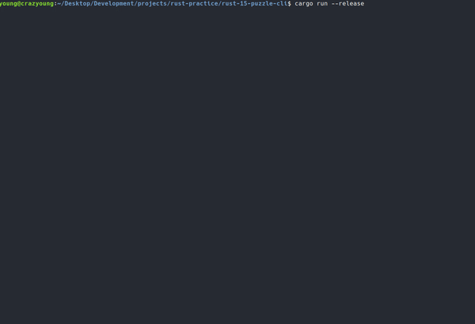
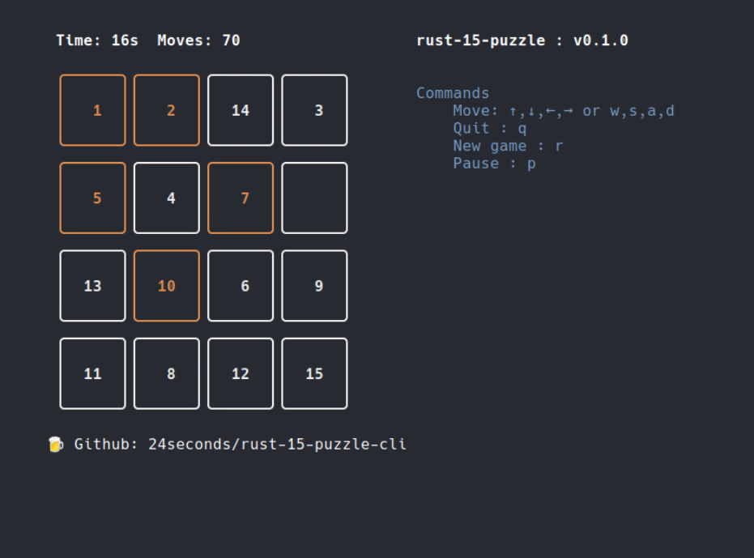
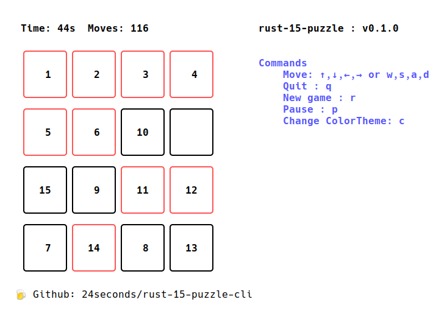
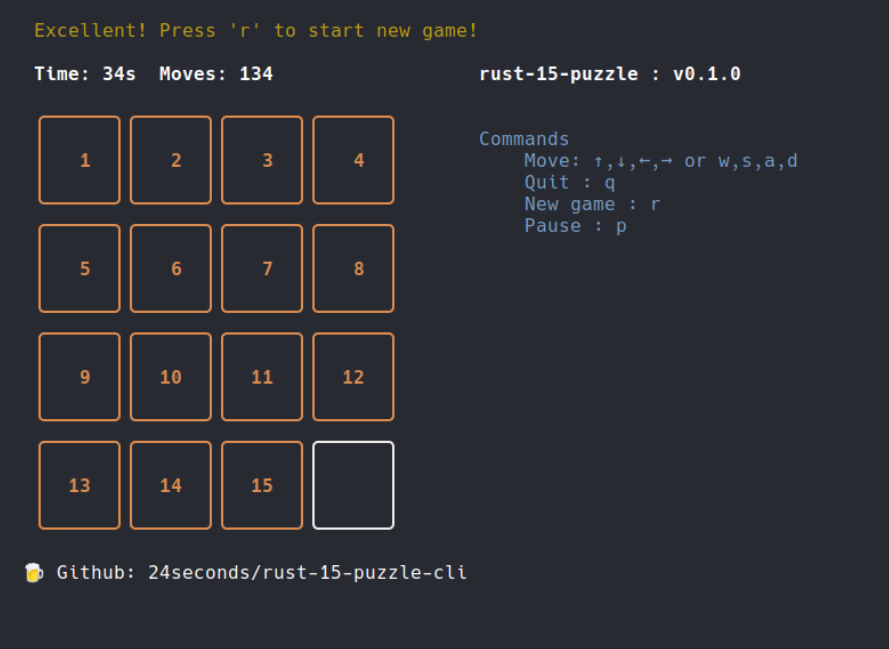

# 🧩 rust-15puzzle-cli

[`15 puzzle`](https://en.wikipedia.org/wiki/15_puzzle) terminal game written in Rust!


### Demo




#### Game playing screenshot


### DarkMode



### LightMode



#### Finishing screenshot




--------------------

### 🎮 How to use?

#### Cargo run!
```
$ cargo run --release
```

Commands 

```md
Move: ↑,↓,←,→ or w,s,a,d
Quit : q
New game : r
Pause : p
```

--------------

#### Installation

For rust users

```
$ cargo install rust-15-puzzle-cli
```
